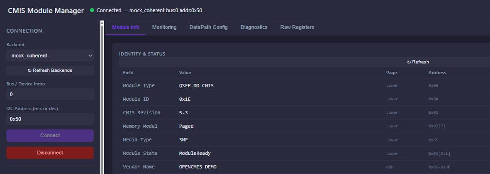

# CMIS Module Manager

A browser-based management tool for CMIS-compliant optical modules (QSFP-DD 800G / 400G and other form factors), built with Flask and vanilla JavaScript. Strictly follows the OIF CMIS 5.4 specification.

基于 Flask + 原生 JS 的光模块可视化管理 Web 工具，严格遵循 OIF CMIS 5.4 规范，支持 QSFP-DD 800G / 400G 等 CMIS 兼容模块。



## 📥 下载 / Download

**免安装 Windows 版：[最新 Release](https://github.com/zhh198903-ctrl/cmis-module-manager/releases/latest)**

下载 `CMIS_dist_v<版本>.zip`，解压后双击 `CMIS_Module_Manager.exe` 即可使用 —— 单文件自包含，
目标机**无需安装 Python**。首次运行 Windows SmartScreen 可能拦截，点「更多信息 → 仍要运行」。

| 解压后的文件 | 说明 |
|---|---|
| `CMIS_Module_Manager.exe` | 单文件 Windows EXE，双击即用 |
| `CMIS模块管理工具操作手册.html` | 完整中文操作手册（浏览器打开） |
| `screenshot_main.png` / `qrcode.jpg` | 辅助资源 |

> ⚠️ **v2.0.0 及更早版本存在 Page 10h 控制寄存器地址错位**，在真实模块上会导致 TX Disable 实际
> 翻转极性、写 RX 极性掩码误触发 ApplyDPInit。**请务必升级到 v2.0.1 或更新版本。**

## Features / 功能

- **Register access 寄存器读写** — raw read/write on any Page/Address, with CMIS field decoding
- **Module info 模块信息** — vendor identity, capabilities, power class, applications advertising
- **Real-time monitoring 实时监控** — temperature, VCC, per-lane Tx/Rx power and bias with alarm thresholds
- **DataPath control 数据通道配置** — AppSel provisioning, DataPath state machine, output/squelch controls
- **Diagnostics 诊断** — loopback, PRBS generator/checker, BER, SNR, error counters
- **Laser tuning 激光器调谐** — grid/channel selection and fine tuning for tunable (coherent) modules
- **7 built-in mock modules 内置模拟模块** — `mock_coherent` / `mock_coherent_zr` / `mock_dr8` / `mock_sr8` / `mock_fr4x2` / `mock_1600g_dr8` / `mock_1600g_16lane`, full demo without any hardware. Two profiles are modelled on IEEE P802.3dj/D3.1: `mock_1600g_dr8` on Clause 180 (1.6TBASE-DR8) and `mock_coherent` on Clause 185 (800GBASE-LR1, the datacenter coherent-lite PMD). `mock_coherent_zr` is the tunable C-band module, which is where laser tuning is demonstrated.

## Supported hardware / 支持的硬件

| Backend | Adapter |
|---|---|
| `ch341` | WCH CH341 USB-I2C |
| `ch347` | WCH CH347 USB-I2C |
| `ftdi`  | FTDI FT232H / FT2232H (via pyftdi) |
| `mock_*` | No hardware needed — simulated modules |

## Quick start / 快速开始

```bash
pip install -r requirements.txt
python app.py
```

Then open **http://127.0.0.1:5000** in your browser. Pick a `mock_*` backend and click *Connect* to explore without hardware.

浏览器打开 `http://127.0.0.1:5000`，选择任一 `mock_*` 后端点击 Connect 即可无硬件体验全部功能。

## Tests / 测试

```bash
python test_api.py
```

273 end-to-end API tests run against the Flask test client with the mock backend — no hardware required.

## Building a standalone EXE / 构建独立 EXE

```bash
packaging/build_exe.bat   # PyInstaller onefile build
```

The result is `CMIS2Customer/CMIS_Module_Manager.exe`, a single self-contained
file that bundles the Python runtime, Flask, the templates and the static assets.
It runs on a machine with no Python installed — double-click it and the UI opens
at `http://127.0.0.1:5000`.

Prebuilt Windows binaries are attached to each
[Release](https://github.com/zhh198903-ctrl/cmis-module-manager/releases).

## Project layout / 目录结构

```
app.py                  Flask REST API + static hosting entry point
cmis_registers.py       CMIS 5.4 register map / field decoding
i2c_interface.py        Backend factory (list_backends / create_backend)
i2c_backends/           I2C adapter backends (ch341 / ch347 / ftdi / mock)
templates/index.html    Single-page UI
static/                 app.js / style.css
test_api.py             End-to-end API tests
packaging/              PyInstaller spec + EXE build script
CMIS2Customer/          Distribution package content (manual + assets)
```

## Notes / 说明

- The OIF CMIS 5.4 specification, SFF-8024 and IEEE P802.3dj are **not** included in this repository. Get CMIS from the [OIF website](https://www.oiforum.com/technical-work/implementation-agreements-ias/), SFF-8024 from [SNIA](https://www.snia.org/technology-communities/sff/specifications), and 802.3dj from the [IEEE 802.3 task force](https://www.ieee802.org/3/dj/).
- Vendor names appearing in the mock profiles are simulated demo data and do not imply any affiliation.

## License

[MIT](LICENSE)
